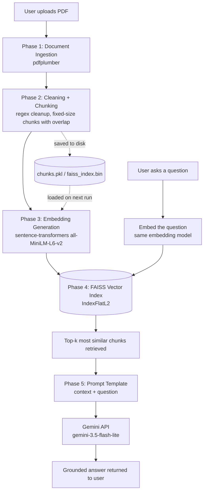

# Intelligent Document Assistant using Retrieval-Augmented Generation (RAG)

A capstone project (GUVI/HCL) implementing a complete, end-to-end RAG pipeline: users upload a PDF document and ask natural-language questions, and the system retrieves relevant sections and generates grounded, context-aware answers using a Large Language Model.

**Domain:** Enterprise Knowledge Management

---

## Overview

Organizations store large volumes of information in PDFs, reports, and internal documentation, and employees often spend significant time manually searching through these documents. This project builds an AI-powered assistant that solves that problem: upload a PDF, ask a question in plain English, and get an answer grounded in the document's actual content — not the model's general knowledge.

The system is built in two parallel forms:
- **A Jupyter Notebook** (`notebooks/RAG_Project_Clean.ipynb`) — the full pipeline, developed and explained step by step, intended to demonstrate understanding of every phase.
- **A Streamlit web app** (`app/app.py`) — the same pipeline wrapped in an interactive UI for practical use.

---

## Architecture



**Pipeline stages:**

| Phase | What happens | Key library |
|---|---|---|
| 1. Ingestion | Extract raw text from every PDF page | `pdfplumber`, `pypdf` (fallback) |
| 2. Chunking | Clean text (regex) and split into overlapping ~500-character chunks | Python `re` |
| 3. Embeddings | Convert each chunk into a 384-dimensional vector capturing meaning | `sentence-transformers` (`all-MiniLM-L6-v2`) |
| 4. Retrieval | Store vectors in a FAISS index; given a question, find the most similar chunks | `faiss-cpu` |
| 5. Generation | Build a grounded prompt from retrieved chunks and generate an answer | Google Gemini API (`gemini-3.5-flash-lite`) |
| 6. Application | Wrap the pipeline in an interactive web UI | `streamlit` |

---

## Tech Stack

- **Language:** Python 3.13
- **PDF extraction:** pdfplumber, pypdf
- **Embeddings:** sentence-transformers (open-source, `all-MiniLM-L6-v2`, 384 dimensions)
- **Vector database:** FAISS (`IndexFlatL2`)
- **LLM:** Google Gemini API (`gemini-3.5-flash-lite`)
- **Web app:** Streamlit
- **Development environments:** Google Colab (notebook), VS Code (app)

---

## Project Structure

```
rag_project/
├── app/
│   └── app.py                 # Streamlit application
├── notebooks/
│   └── RAG_Project_Clean.ipynb  # Full pipeline notebook
├── src/
│   └── ingestion.py            # Standalone ingestion module (early prototype)
├── data/                        # Place PDF documents here (not committed to git)
├── outputs/                     # Cached chunks.pkl / faiss_index.bin (not committed)
├── .gitignore
├── requirements.txt
└── README.md
```

---

## Setup Instructions

### Option A: Run the Notebook (Google Colab)

1. Upload `notebooks/RAG_Project_Clean.ipynb` to [Google Colab](https://colab.research.google.com).
2. Upload your target PDF to `MyDrive/rag_project/data/` in Google Drive.
3. Get a free Gemini API key from [Google AI Studio](https://aistudio.google.com/apikey).
4. In Colab, open the Secrets manager (key icon in the left sidebar) and add a secret named `GEMINI_API_KEY` with your key as the value. Enable notebook access.
5. Update the `PDF_PATH` variable in the notebook to match your uploaded filename.
6. Run **Runtime > Run all**. On the very first run, if you hit a Pillow-related `ImportError`, run **Runtime > Restart session**, then **Runtime > Run all** again — this only needs to happen once per fresh session.

### Option B: Run the Streamlit App (locally)

1. Clone or download this repository.
2. Create and activate a virtual environment:
   ```
   python -m venv venv
   venv\Scripts\activate      # Windows
   source venv/bin/activate   # Mac/Linux
   ```
3. Install dependencies:
   ```
   pip install -r requirements.txt
   ```
4. Create a `.env` file in the project root with your Gemini API key:
   ```
   GEMINI_API_KEY=your_actual_key_here
   ```
5. Run the app:
   ```
   streamlit run app/app.py
   ```
6. Upload a PDF through the browser interface and ask questions.

---

## Usage

1. Upload a PDF document through the file uploader.
2. Wait for processing (extraction, chunking, embedding, indexing) — a spinner shows progress.
3. Type a question about the document's content.
4. Click "Get Answer" to receive a grounded response.

If the answer isn't present in the document, the system explicitly says so rather than guessing from general knowledge (see Evaluation Findings below).

---

## Dataset

Primary dataset used for development and testing: **Apple Inc. FY2025 Form 10-K** (SEC annual report), sourced from Apple's investor relations site. 780 chunks generated from a 272,956-character extracted document.

---

## Evaluation Findings

### 1. PDF extraction can silently fail on design-heavy documents
An initial test document (a graphically designed travel guide PDF) extracted **0 characters on 14 of its 16 pages** — only 2 pages yielded real text. Diagnosis confirmed the missing pages had no underlying text layer, likely because the document was exported from a design tool with content flattened into images. This is a genuine, known limitation of text-based PDF extraction (not a bug in the code) and would require OCR (Optical Character Recognition) to resolve — out of scope for this project but a clear direction for future work. Real-world SEC filings (like the Apple 10-K used for final testing) do not exhibit this issue, since they are generated from structured text sources.

### 2. Numeric tables spanning chunk boundaries reduce retrieval precision
Multiple test cases (a phone-number lookup, and two Apple 10-K financial figures — a country revenue table and a geographic segment table) showed that fixed-size chunking can split a table or sentence exactly at the point where the needed figure appears, and that neighboring chunks are not always ranked in the top-k retrieved results.

- Increasing `top_k` from 3 to 5 did not reliably surface the missing figure.
- Increasing `overlap` from 50 to 150 characters measurably improved the top-1 match distance (0.848 → 0.813 in one test case) but did not fully resolve retrieval of tightly-packed numeric tables, since multiple financial tables in the same document produce semantically similar embeddings and compete for the same top-k slots.
- **Conclusion:** semantic embedding search is well-suited to narrative/descriptive text but has known limitations distinguishing between structurally similar numeric tables. Future improvements could include hybrid search (combining semantic similarity with exact keyword matching, e.g. BM25) or table-aware chunking that keeps entire tables intact as single chunks.

### 3. Groundedness / honesty verification
The system was explicitly tested with out-of-domain questions (e.g. "What is the capital of France?" against the Apple 10-K). In all such cases, the system correctly responded "I don't have enough information to answer that" rather than answering from the LLM's general knowledge — confirming the prompt template's grounding instruction is effective.

### 4. Free-tier LLM API quota constraints
The initial model choice (`gemini-3.6-flash`) has a free-tier limit of only 20 requests/day, insufficient for iterative development and testing. Switched to `gemini-3.5-flash-lite`, which offers a substantially higher free-tier daily quota while maintaining acceptable answer quality for this use case.

---

## Known Limitations

- Fixed-size character-based chunking does not respect sentence or table boundaries, which can occasionally split relevant information across chunks.
- Retrieval quality on dense numeric/tabular content is lower than on narrative text.
- PDF extraction depends on the source PDF containing an actual text layer; image-only or heavily flattened pages will not be processed.
- The Streamlit app rebuilds the index from scratch on each new PDF upload (no persistent caching across app restarts, unlike the notebook).

## Future Improvements

- Hybrid retrieval combining semantic search with keyword-based matching (e.g. BM25).
- Table-aware or semantic (sentence-boundary-respecting) chunking instead of fixed character counts.
- OCR fallback for image-only PDF pages.
- Persistent caching in the Streamlit app, mirroring the notebook's chunks/index save-and-load pattern.
- Support for multiple simultaneous documents.

---

## Author

Charanraj — GUVI/HCL Capstone Project (Enterprise Knowledge Management domain).
